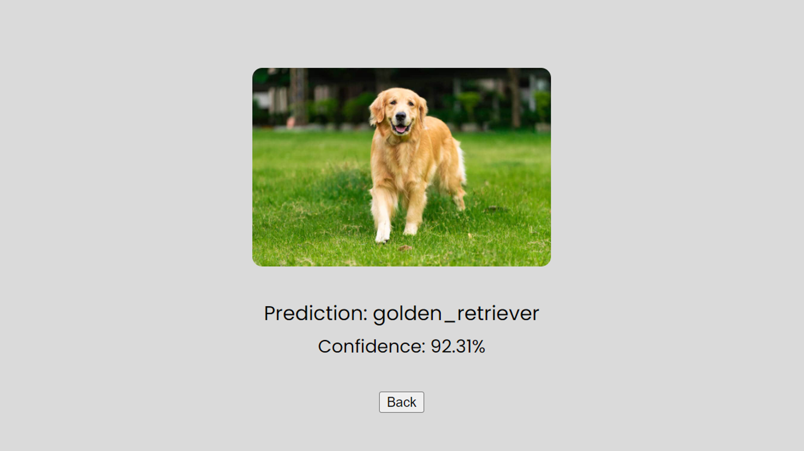

# Image Sense

**Image Sense** is a web-based image classification application built using **Flask** and **MobileNetV2**, a pre-trained deep learning model from TensorFlow. This application allows users to upload images and returns the top predicted label along with a confidence score.

## Features

- Upload any image and receive a prediction on its classification.
- Uses **MobileNetV2**, a lightweight deep learning model trained on the **ImageNet** dataset.
- Displays the predicted class and the confidence percentage.
- Simple and intuitive user interface.

## Demo

Here’s how the app works:

1. User uploads an image via a form.
2. The image is processed using **MobileNetV2**.
3. The top prediction and confidence score are displayed on the screen.

## Technologies Used

- **Python**: Main programming language.
- **Flask**: Backend framework for serving the web application.
- **TensorFlow**: For deep learning and image classification using MobileNetV2.
- **HTML/CSS**: Frontend of the web app.
- **MobileNetV2**: Pre-trained deep learning model on ImageNet dataset.

## Setup Instructions

## Setup Instructions

To run the project locally, follow these steps:

1. Clone the repository:
   - `git clone https://github.com/danrmzz/image-sense`
   - `cd image-sense`

2. Create a virtual environment:
   - `python3 -m venv venv`
   - For Windows: `venv\Scripts\activate`
   - For Mac/Linux: `source venv/bin/activate`

3. Install the required packages by running:
   - `pip install -r requirements.txt`

4. Run the application:
   - `python app.py`

5. Open your browser and go to:
   - `http://127.0.0.1:5000/`

